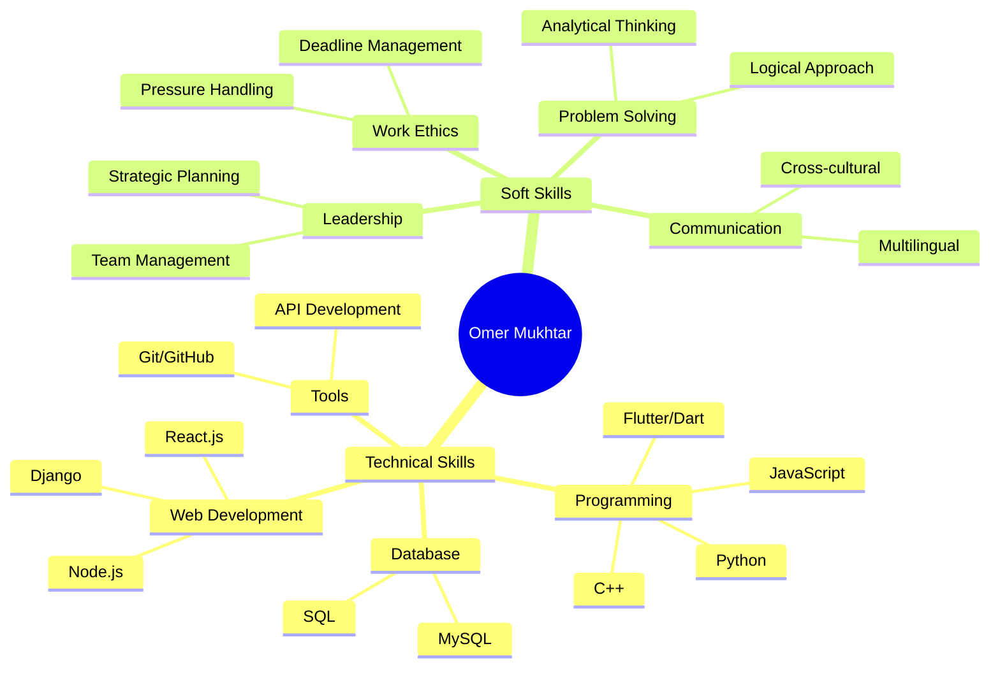

<div align="center">

<!-- Dynamic Typing Animation -->
[](https://git.io/typing-svg)

<!-- Animated Wave -->


<!-- Profile Views Counter with Style -->


</div>

---

<div align="center">

## 🎯 **Professional Overview**

</div>

<div align="center">
<table>
<tr>
<td>

<!-- Left Column - Personal Info Card -->
### 📋 **Personal Details**
```yaml
name: "Omer Mukhtar Saeed"
location: "Erbil, Kurdistan Region, Iraq 🇮🇶"
age: 24
nationality: "Iraqi - Kurdish"
languages: ["Kurdish (Native)", "English (Good)", "Arabic (Basic)"]
contact: 
  email: "omermukhtar55@gmail.com"
  phone: "+964 751 449 0547"
  portfolio: "https://omarmukhtar.me"
  github: "https://github.com/omerrmukhtarr"
```

</td>
<td>

<!-- Right Column - Professional Info Card -->
### 🎓 **Education & Career**
```yaml
current_education:
  university: "University of Lebanese French (LFU)"
  degree: "Bachelor's in Computer Engineering"
  year: "2022 - Present (3rd Year)"
  
previous_education:
  institution: "Erbil Polytechnic University"
  degree: "Diploma in Information Technology"
  completed: "2018 - 2020"
  
career_focus: ["Full Stack Development", "Mobile Applications", "Web Development"]
```

</td>
</tr>
</table>
</div>

---

<div align="center">

## 💼 **Professional Experience**

</div>

<div align="center">

| 🏢 **Company** | 📅 **Duration** | 🛠️ **Role** | 🔗 **Project** |
|:---:|:---:|:---:|:---:|
| **Full Stop Company** | Jan 2023 - Present | Web Developer | [fullstop.krd](https://www.fullstop.krd) |
| **Jamana Real Estate** | Nov 2024 - Present | Web Developer | [jamana-realestate.com](https://www.jamana-realestate.com/) |

</div>

---

<div align="center">

## 🚀 **Technology Stack**

<!-- Advanced Tech Stack with Beautiful Icons -->


</div>

### **🎯 Skill Proficiency Matrix**
<div align="center">

| **Technology** | **Proficiency** | **Experience** | **Projects** |
|:---|:---:|:---:|:---:|
| **JavaScript** |  | 2+ years | 5+ |
| **Flutter & Dart** |  | 2+ years | 3+ |
| **C++** |  | 3+ years | 4+ |
| **Git & GitHub** |  | 3+ years | 20+ |
| **SQL Database** |  | 2+ years | 5+ |
| **React.js** |  | 1+ years | 3+ |
| **Node.js** |  | 1+ years | 3+ |
| **Python & Django** |  | 1+ years | 2+ |

</div>

### **🔧 Development Environment**
<p align="center">
  
  
  
  
  
  
  
  
</p>

---

<div align="center">

## 📊 **GitHub Analytics Dashboard**

</div>

<!-- GitHub Stats Cards with Multiple Themes -->
<div align="center">
  
  
</div>

<!-- Detailed Language Stats -->
<div align="center">
  
  
</div>

<!-- Activity Graph -->
<div align="center">
  
</div>

<!-- GitHub Trophies -->
<div align="center">
  
</div>

---

<div align="center">

## 🏆 **Certifications & Training**

</div>

<div align="center">

| 🎓 **Certification** | 🏢 **Institution** | 📅 **Year** | 🔗 **Verification** |
|:---|:---:|:---:|:---:|
| **Meta Back-End Engineer Bootcamp** | Meta (Coursera) | 2024 | ✅ Verified |
| **WeCode Mobile App Bootcamp** | Rwanga Foundation | 2022 | ✅ Completed |
| **Jousour Program** | WFP | 2023 | ✅ Participated |

</div>

---

<div align="center">

## 🎯 **Featured Projects**

</div>

<!-- Dynamic Project Cards -->
<div align="center">
<a href="https://github.com/omerrmukhtarr/Erbil-Cafe">
  
</a>
<a href="https://github.com/omerrmukhtarr/littlelemon-capstone-omer">
  
</a>
</div>

### 🚀 **Current Work**
- 🌐 **Full Stop Company** - Building modern web solutions
- 🏘️ **Jamana Real Estate** - Developing real estate platform
- 📱 **Erbil Cafe App** - Flutter mobile application
- 🍋 **Little Lemon** - Meta Back-End Capstone Project

---

<div align="center">

## 💡 **Professional Competencies**

</div>

<div align="center">



</div>

---

<div align="center">

## 🌐 **Connect & Collaborate**

<!-- Social Media with Advanced Styling -->
<a href="https://omarmukhtar.me">
  
</a>
<a href="mailto:omermukhtar55@gmail.com">
  
</a>
<a href="https://github.com/omerrmukhtarr">
  
</a>
<a href="https://linkedin.com/in/omer-mukhtar">
  
</a>
<a href="tel:+9647514490547">
  
</a>

</div>

---

<div align="center">

## 🎮 **Fun Zone**

<!-- Snake Animation -->
<picture>
  <source media="(prefers-color-scheme: dark)" srcset="https://raw.githubusercontent.com/omarrmukhtarr/omarrmukhtarr/output/github-contribution-grid-snake-dark.svg">
  <source media="(prefers-color-scheme: light)" srcset="https://raw.githubusercontent.com/omarrmukhtarr/omarrmukhtarr/output/github-contribution-grid-snake.svg">
  
</picture>

<!-- Random Dev Quote -->


</div>

---

<div align="center">

## 📈 **Career Goals & Vision**

*"Building the future of Kurdistan's tech ecosystem, one line of code at a time"*

### 🎯 **2025 Objectives**
- 🚀 Launch innovative mobile applications
- 🌐 Contribute to Kurdistan's digital transformation
- 📚 Complete Computer Engineering degree
- 💼 Expand professional network in tech industry

<!-- Footer -->


**Thanks for visiting! Let's connect and build something amazing together! 🚀**
*Available for freelance projects and collaboration opportunities*

📞 **+964 751 449 0547** | 📧 **omermukhtar55@gmail.com** | 🌐 **omarmukhtar.me**

</div>
