```mermaid
mindmap
  root((🌟 OMER MUKHTAR 🌟))
    Technical Excellence
      Programming Languages
        JavaScript (Expert)
        Python (Advanced)
        C++ (Proficient)
        Dart/Flutter (Expert)
      Web Development
        React.js (Advanced)
        Node.js (Advanced)
        Django (Intermediate)
        HTML/CSS (Expert)
      Mobile Development
        Flutter (Expert)
        Cross-platform (Advanced)
        UI/UX Design (Proficient)
      Database Management
        MySQL (Advanced)
        PostgreSQL (Intermediate)
        SQL Optimization (Proficient)
    Professional Skills
      Leadership
        Team Collaboration
        Project Management
        Strategic Planning
      Communication
        Multilingual (3 languages)
        Cross-cultural
        Technical Writing
      Problem Solving
        Analytical Thinking
        Creative Solutions
        Debugging Mastery
      Work Ethic
        Deadline Management
        Quality Focus
        Continuous Learning
```

<div align="center">

<!-- Advanced Animated Header with Gradient Text -->
<div align="center">
  
</div>

<!-- Advanced Profile Banner with Glowing Effect -->


<!-- Advanced Profile Stats with Custom Styling -->
<div align="center">
  
</div>

</div>

---

<div align="center">

<!-- Advanced Personal Card with Gradient Border -->
<div style="background: linear-gradient(45deg, #0d1117, #161b22); border-radius: 20px; padding: 30px; border: 2px solid transparent; background-clip: padding-box; box-shadow: 0 20px 40px rgba(0,217,255,0.1);">

###  **DIGITAL IDENTITY** 

```yaml
👤 Name: "Omer Mukhtar Saeed"
🌍 Location: "Erbil, Kurdistan Region, Iraq 🇮🇶"
🎂 Age: "24 Years Young"
🎓 Education: "Computer Engineering (3rd Year) - LFU"
🗣️ Languages:
  ["Kurdish (Native)", "English (Fluent)", "Arabic (Conversational)"]
📧 Contact: "omermukhtar55@gmail.com"
🌐 Portfolio: "omarmukhtar.me"
💼 Status: "Available for Epic Projects"
```

</div>

</div>

---

<div align="center">

<!-- Advanced Technology Showcase -->


<div style="margin: 30px 0;">

### 🌟 **CORE COMPETENCIES** 🌟


### 🌐 **WEB DEVELOPMENT DOMINION** 🌐


### 🛠️ **DEVELOPMENT TOOLS & DATABASES** 🛠️


</div>

</div>

---

<div align="center">

<!-- Advanced Professional Experience with Cards -->


<div style="display: flex; flex-wrap: wrap; justify-content: center; gap: 20px; margin: 30px 0;">

<div style="background: linear-gradient(135deg, #667eea 0%, #764ba2 100%); border-radius: 15px; padding: 25px; width: 300px; box-shadow: 0 15px 35px rgba(102, 126, 234, 0.3); transform: perspective(1000px) rotateY(-5deg); transition: transform 0.3s ease;">

**🏢 Full Stop Company**  
**_Senior Web Developer_**  
📅 **Jan 2023 - Present**  
🌐 **[fullstop.krd](https://www.fullstop.krd)**  
💡 _Building modern web solutions_

</div>

<div style="background: linear-gradient(135deg, #f093fb 0%, #f5576c 100%); border-radius: 15px; padding: 25px; width: 300px; box-shadow: 0 15px 35px rgba(245, 87, 108, 0.3); transform: perspective(1000px) rotateY(5deg); transition: transform 0.3s ease;">

**🏘️ Jamana Real Estate**  
**_Web Developer_**  
📅 **Nov 2024 - Present**  
🌐 **[jamana-realestate.com](https://www.jamana-realestate.com/)**  
💡 _Real estate platform development_

</div>

<div style="background: linear-gradient(135deg, #4facfe 0%, #00f2fe 100%); border-radius: 15px; padding: 25px; width: 300px; box-shadow: 0 15px 35px rgba(79, 172, 254, 0.3); transform: perspective(1000px) rotateY(-5deg); transition: transform 0.3s ease;">

**☕ Erbil Cafe**  
**_Mobile App Developer_**  
📅 **Sep 2022**  
📱 **[GitHub Project](https://github.com/omarrmukhtarr/Erbil-Cafe)**  
💡 _Flutter mobile application_

</div>

</div>

</div>

---

<div align="center">

<!-- Advanced GitHub Analytics with Custom Styling -->


<div style="margin: 30px 0;">


</div>

<!-- Advanced Activity Graph -->


</div>

---

<div align="center">

<!-- Advanced Featured Projects -->


<div style="margin: 30px 0;">

<a href="https://github.com/omarrmukhtarr/Erbil-Cafe">
  
</a>

<a href="https://github.com/omarrmukhtarr/littlelemon-capstone-omer">
  
</a>

</div>

### 🎯 **CURRENT WORKSPACE**

<div style="background: linear-gradient(45deg, #0d1117, #161b22); border-radius: 15px; padding: 25px; border: 1px solid #00D9FF; margin: 20px 0;">

- 🌐 **Full Stop Company** - _Crafting modern web solutions_
- 🏘️ **Jamana Real Estate** - _Building real estate platforms_
- 📱 **Erbil Cafe App** - _Flutter mobile innovation_
- 🍋 **Little Lemon** - _Meta Back-End excellence_

</div>

</div>

---

<div align="center">

<!-- Advanced Certifications -->


<div style="background: linear-gradient(135deg, #667eea 0%, #764ba2 100%); border-radius: 20px; padding: 30px; margin: 30px 0; box-shadow: 0 20px 40px rgba(102, 126, 234, 0.3);">

| 🏆 **Certification**                | 🏢 **Institution** | 📅 **Year** |  ✅ **Status**   |
| :---------------------------------- | :----------------: | :---------: | :--------------: |
| **Meta Back-End Engineer Bootcamp** |  Meta (Coursera)   |    2024     |   **VERIFIED**   |
| **WeCode Mobile App Bootcamp**      | Rwanga Foundation  |    2022     |  **COMPLETED**   |
| **Jousour Program**                 |        WFP         |    2023     | **PARTICIPATED** |

</div>

</div>

---

<div align="center">

<!-- Advanced Skills Mindmap -->




</div>

---

<div align="center">

<!-- Advanced Contact Section -->


<div style="background: linear-gradient(45deg, #0d1117, #161b22); border-radius: 20px; padding: 30px; border: 2px solid transparent; background-clip: padding-box; box-shadow: 0 20px 40px rgba(0,217,255,0.1); margin: 30px 0;">

[](https://omarmukhtar.me)
[](mailto:omermukhtar55@gmail.com)
[](https://github.com/omarrmukhtarr)
[](https://linkedin.com/in/omer-mukhtar)

</div>

<!-- Advanced Footer with Vision -->


<div style="background: linear-gradient(135deg, #667eea 0%, #764ba2 100%); border-radius: 20px; padding: 30px; margin: 30px 0; box-shadow: 0 20px 40px rgba(102, 126, 234, 0.3);">

### 🎯 **MISSION STATEMENT**

**_"Pioneering Kurdistan's digital transformation through innovative technology solutions, one groundbreaking project at a time"_** 🌟

### 🚀 **2025 OBJECTIVES**

- 🚀 **Launch** revolutionary mobile applications
- 🌐 **Transform** Kurdistan's digital landscape
- 📚 **Complete** Computer Engineering degree
- 💼 **Expand** global tech network
- 🏆 **Achieve** industry recognition

</div>

---

<div style="background: linear-gradient(45deg, #0d1117, #161b22); border-radius: 20px; padding: 30px; border: 2px solid #00D9FF; text-align: center; margin: 30px 0;">

**📞 +964 751 449 0547** | **📧 omermukhtar55@gmail.com** | **🌐 omarmukhtar.me**

**_Ready to collaborate on extraordinary projects that shape the future!_** 🚀

</div>

<!-- Advanced Animated Footer -->


</div>
